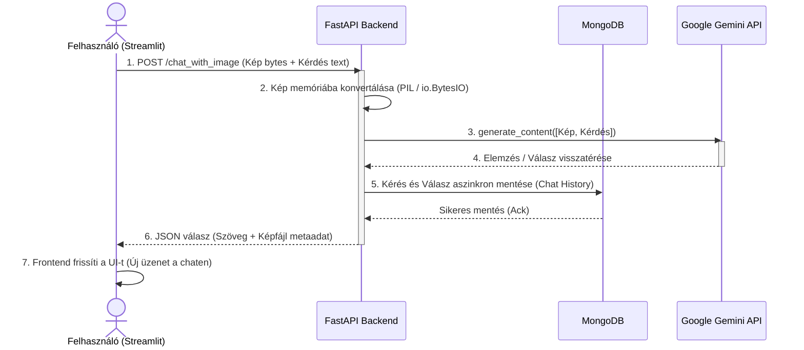

# Komplex MI alkalmazások fejlesztése

A projekt célja, hogy a hagyományos "Jupyter Notebook" szintű kísérletezésen túllépve, egy valós, skálázható szoftverarchitektúrát hozzunk létre, amely egy FastAPI backendből, egy Streamlit frontendből, valamint több adatbázisból áll.

---

##  RAG és a "Memória"

A modern Nagy Nyelvi Modellek (LLM-ek, mint a Gemini) lenyűgözőek, de van két komoly kihívás velük kapcsolatban:
1. **Nincs friss/privát tudásuk:** Nem látnak bele a vállalatod belső dokumentumaiba.
2. **"Amnéziásak":** Minden HTTP kérést tiszta lappal kezdenek, nem emlékszenek az egy perccel ezelőtt feltett kérdésedre.

Ezt a két problémát oldjuk meg az architektúránkkal:

### 1. RAG (Retrieval-Augmented Generation) és Vektorok
A saját dokumentumainkat vektorokká (számsorozatokká) alakítjuk az **Embedding** technológia segítségével, és egy **ChromaDB vektoradatbázisban** tároljuk. Amikor a felhasználó kérdez, a rendszer megkeresi a leginkább releváns bekezdéseket a térben, és ezt "puskaként" átadja a modellnek.

### 2. Állapottartó (Stateful) Beszélgetés és NoSQL
Ahhoz, hogy a gép emlékezzen a beszélgetés fonalára, bevezettünk egy **MongoDB (NoSQL) adatbázist**. 
* **Miért NoSQL?** Az MI-vel folytatott beszélgetések (kiküldött promptok, kapott válaszok, metaadatok) természetes módon JSON/dokumentum formátumúak, amire a MongoDB tökéletes választás. A relációs adatbázisok (SQL) ehhez túl merevek lennének.
* A rendszer generál egy `session_id`-t, és minden üzenetváltást letárol, így a következő kérdésnél a FastAPI a teljes beszélgetési előzményt fel tudja tölteni a modell memóriájába.

---

## Technológiai Stack és Architektúra

A projekt a legmodernebb ipari standardokra (Docker Compose) épül:
* **Környezet:** Docker DevContainer (Python App + MongoDB konténerek közös hálózaton).
* **Backend:** `FastAPI` (Aszinkron API), `Motor` (Aszinkron MongoDB driver) és `Pillow` (Memórián belüli képkezelés).
* **Frontend:** `Streamlit` (Modern, Python-alapú chat UI).
* **Adatbázisok:** `ChromaDB` (vektoroknak) és `MongoDB` (munkameneteknek és chat logoknak).
* **MI Integráció:** Hivatalos `google-genai` SDK.

---

## Fejlesztői Környezet Indítása

### 1. Előfeltételek és Beállítások
Győződj meg róla, hogy a VS Code-ban a DevContainer felépült (a Docker Compose alapján). 
Létre kell hoznod egy `.env` nevű fájlt a projekt gyökerében:
```env
GEMINI_API_KEY=ide_masold_a_sajat_kulcsod
```

## 2. Csatlakozás a MongoDB-hez (VS Code Plugin)
Nem kell vaktában kódolnod! A DevContainer tartalmaz egy hivatalos MongoDB kiterjesztést.

Kattints a VS Code bal oldali sávjában a MongoDB (falevél) ikonra.

Kattints az Add Connection gombra.

A fenti parancssorba írd be: mongodb://mongo:27017 majd nyomj Entert.
> (Megjegyzés: A Docker belső hálózata miatt a host nevünk mongo, nem pedig localhost!)

## 3. A Szolgáltatások Futtatása (Makefile)
A backendet és a frontendet két külön terminálablakban kell futtatnod!

A Backend API indítása:
Nyiss egy terminált, és add ki az alábbi parancsot (indul a `http://localhost:8000` címen).
```bash
make run-api
```

UI indítása:
Nyiss egy ÚJ terminálablakot (a + ikonnal), és indítsd el a felhasználói felületet:

```bash
make run-app
```

> Ez automatikusan megnyitja a böngészőben a Streamlit alkalmazást (jellemzően a http://localhost:8501 címen).

### 3. Multimodális Gépi Látás (Vision)
A rendszer képes képeket (számlákat, diagramokat, vizuális adatokat) fogadni és feldolgozni a Gemini 1.5 Flash modell segítségével, ami közvetlenül strukturált adatokat vagy elemzést generál a bináris fájlokból.

###  Az Adatfolyam Vizualizációja (Multimodális Látvány)
Az alábbi ábra bemutatja, hogyan utazik egy képes-szöveges kérés a kliensgéptől egészen az MI szerveréig és vissza:


## Project struktúra

```
/
├── .devcontainer/
│   ├── devcontainer.json
│   └── docker-compose.yml    # Itt van definiálva a Python és a MongoDB konténer
├── src/
│   ├── backend/          
│   │   └── api.py            # FastAPI végpontok (RAG és Chat logika)
│   └── frontend/
│       └── app.py            # Streamlit UI (Feltöltés és Chat felület)
├── chroma_db/                # Lokális vektoradatbázis (automatikusan létrejön)
├── requirements.txt          # Függőségek (FastAPI, Streamlit, motor, chromadb, stb.)
├── Makefile                  # Egyszerűsített parancsok futtatáshoz
└── .env                      # API kulcsok (NE KÜLDD BE GITHUB-RA!)
```
---

## ⚠️ Ismert jelenségek (Hibatűrés)

Mivel az alkalmazás élő felhőszolgáltatásokra (Google Gemini API) támaszkodik, előfordulhatnak terhelési tüskék a szervereiken. 
* Ha a felületen `503 UNAVAILABLE` (Leterheltség) hibát kapsz: a Google szerverei ideiglenesen túlterheltek. Várj pár másodpercet és próbáld újra elküldeni az üzenetet.
* Ha a feltöltött képnél a Streamlit figyelmeztetést dob, ellenőrizd, hogy a kiterjesztés szabványos `jpg`, `jpeg` vagy `png` formátumú-e, és mérete nem haladja meg a 20MB-ot.
