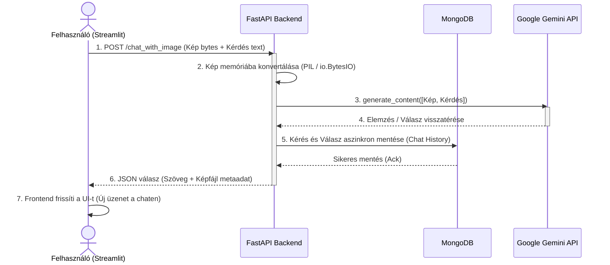

# Komplex MI alkalmazások fejlesztése

## 3. Multimodális Gépi Látás (Vision)
A rendszer képes képeket (számlákat, diagramokat, vizuális adatokat) fogadni és feldolgozni a Gemini 1.5 Flash modell segítségével, ami közvetlenül strukturált adatokat vagy elemzést generál a bináris fájlokból.

### Az Adatfolyam Vizualizációja (Multimodális Látvány)
Az alábbi ábra bemutatja, hogyan utazik egy képes-szöveges kérés a kliensgéptől egészen az MI szerveréig és vissza:

