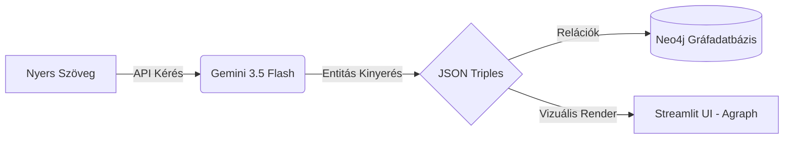

# Komplex MI alkalmazások fejlesztése

## 4. Tudásgráfok és GraphRAG (Neo4j)
A vektorok jók a szemantikai hasonlóság keresésére, de a pontos relációk (pl. "Ki kinek a felettese?") megtalálásához hálózatokra van szükség. A bemeneti szövegekből az MI entitás-kapcsolat hármasokat (Triples) nyer ki, amelyeket egy **Neo4j gráfadatbázisban** tárolunk, a felületen pedig a `streamlit-agraph` segítségével vizuálisan, interaktívan is megjelenítünk.

